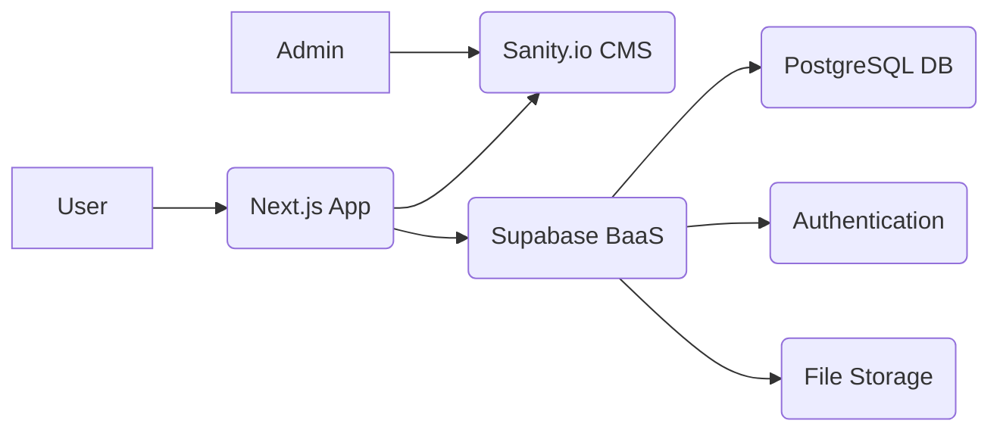

# System Patterns: NaijaLearn

## System Architecture
NaijaLearn follows a modern Jamstack-like architecture leveraging Next.js 15's App Router for a hybrid approach (SSR, SSG, ISR), a headless CMS (Sanity.io) for content, and a Backend-as-a-Service (BaaS) (Supabase) for user authentication, database, and storage. The frontend interacts with Sanity for content fetching and Supabase for user-specific data and authentication.

## Key Technical Decisions
- **Frontend Framework:** Next.js 15 with App Router for routing, rendering strategies (SSR, SSG, ISR), and Server Actions/API Routes for secure backend interactions.
- **Styling:** Tailwind CSS v4 for a utility-first approach, ensuring responsiveness and consistent styling.
- **State Management:** Redux Toolkit for managing global application state, particularly authentication status, UI states, and potentially cached data.
- **Backend & Database:** Supabase provides Authentication, a PostgreSQL Database, and Storage, simplifying backend development with built-in features like Row Level Security (RLS).
- **Content Management:** Sanity.io as a headless CMS for flexible and structured management of all course content and interactive element data.
- **Interactive Libraries:** Specific libraries (`@dnd-kit/core`, `Framer Motion`, `react-leaflet`) chosen for implementing unique cultural interactive components.
- **Type Safety:** TypeScript is used throughout the project.
- **Data Fetching:** Utilizing Next.js `fetch` in Server Components/Route Handlers and `@supabase/supabase-js`, `@sanity/client` for data interactions.

## Design Patterns in Use
- **Component-Based Architecture:** Building the UI with reusable React components (`components/ui/`, `components/features/`).
- **Utility-First CSS:** Leveraging Tailwind CSS classes for styling.
- **State Slices (Redux Toolkit):** Organizing Redux state into logical slices.
- **Protected Routes:** Implementing authentication guards for sensitive routes.
- **Server Components/Client Components:** Strategic use based on data fetching and interactivity needs.
- **Vertical Slice Architecture (Modified):** Implementing features end-to-end incrementally.

## Component Relationships (Illustrative)
- `app/layout.tsx` wraps the application with `Redux Provider` and basic layout (`Navbar`, `Footer`).
- Pages (`app/page.tsx`, `app/courses/page.tsx`, etc.) fetch data (from Sanity/Supabase) and compose feature components.
- Feature components (`components/features/`) like `CourseCard`, `QuizPlayer`, `LessonNavigator`, `InteractiveMap` encapsulate specific functionality and often use UI components (`components/ui/`).
- Authentication components (`components/auth/`) interact with the Supabase client and Redux auth slice.
- Utility functions and client initializations reside in `lib/`.
- Type definitions are centralized in `types/`.